# HACKATHON EXPRESS 2026-2


# 1 Boletería Astor (Astor Box Office)

---
---

# 2 El Sastre a la Medida (Tailor Shop)

---

### Patrón de Diseño

**Categoría:** Creacional

**Patrón Utilizado:** Builder

**Justificación:**
El problema exige construir un objeto complejo (un traje) pieza por pieza, donde algunas partes son obligatorias (tela, saco, pantalón) y otras son opcionales (chaleco, forro en seda, bordado). El patrón Builder es la elección exacta porque separa el proceso de construcción del producto final, permite incluir selectivamente las piezas opcionales, y garantiza que el objeto solo se crea cuando todas las partes obligatorias están presentes.
---

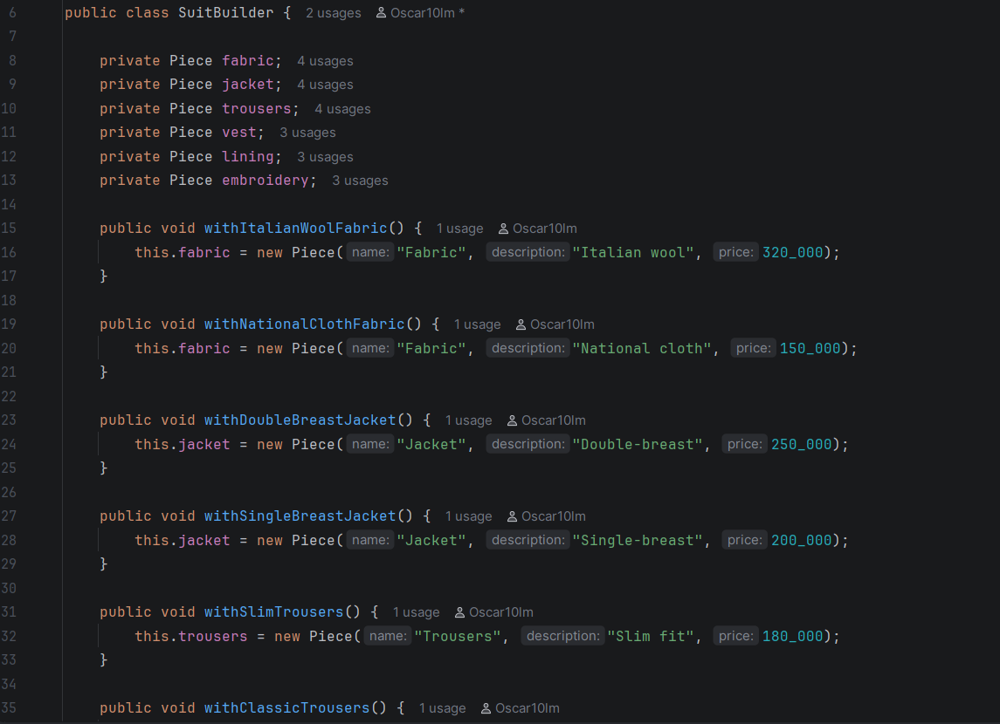

---

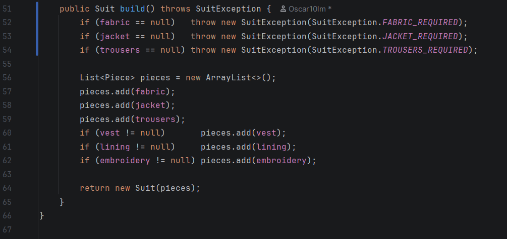

---

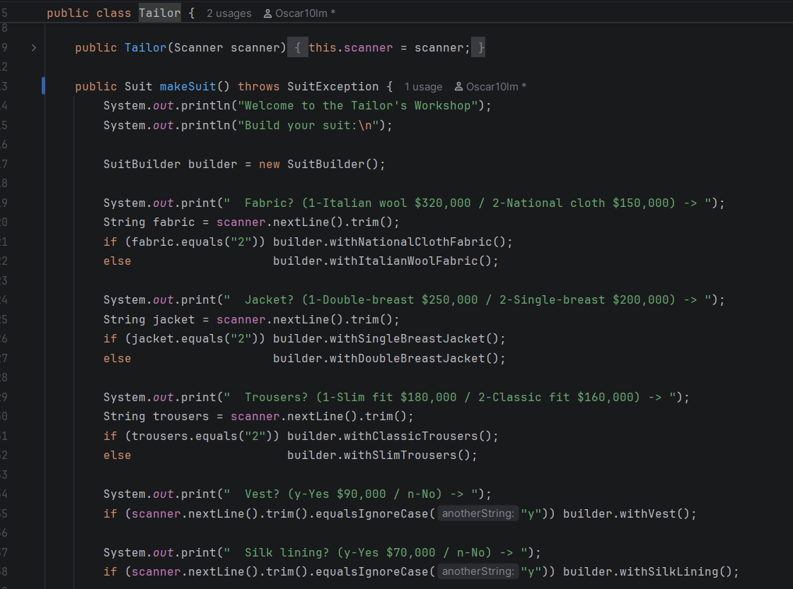


---

**Cómo lo apliqué — clases y rol de cada una:**

| Rol | Clase | Responsabilidad |
|---|---|---|
| **Producto** | `Suit` | Objeto final inmutable que contiene todas las piezas seleccionadas |
| **Builder** | `SuitBuilder` | Ensambla el traje pieza por pieza mediante métodos fluidos y valida las piezas obligatorias en `build()` |
| **Director** | `Tailor` | Dirige la construcción leyendo la entrada del usuario y llamando los métodos del builder correspondientes |
| **Value Object** | `Piece` | Representación inmutable de cada componente del traje (nombre, descripción, precio) |
| **Punto de entrada** | `TailorShop` | Contiene el método estático `run()` que es llamado desde `Application.java` |

---

### Estructura de Clases

| Archivo | Descripción |
|---|---|
| `Piece.java` | Value object inmutable — nombre, descripción y precio de cada pieza |
| `Suit.java` | Producto final — precio total calculado con Streams |
| `SuitBuilder.java` | Builder — valida piezas obligatorias con excepción personalizada |
| `SuitException.java` | Excepción personalizada con constantes para cada validación |
| `Tailor.java` | Director — lee la entrada del usuario y dirige el builder |
| `TailorShop.java` | Punto de entrada — método estático `run()` con manejo de excepciones |

---


---

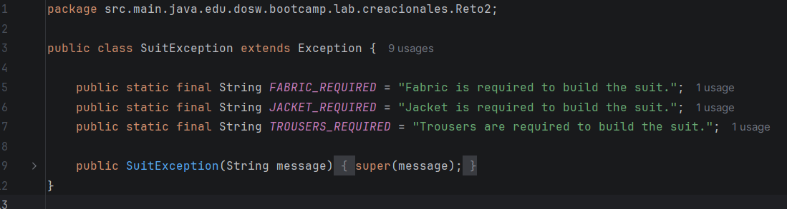

---

### Explicación del Código

1. **`Piece`** — clase `final` con tres campos `private final`. Una vez creado el objeto no puede ser modificado, cumpliendo con el requisito de inmutabilidad.

2. **`SuitBuilder`** — declara un campo `Piece` por cada componente del traje. Cada método `with...()` asigna el campo correspondiente. `build()` exige las tres piezas obligatorias lanzando `SuitException` con constantes descriptivas si falta alguna, luego ensambla y retorna el `Suit`.

3. **`SuitException`** — excepción personalizada que extiende `Exception`. Define constantes `FABRIC_REQUIRED`, `JACKET_REQUIRED` y `TROUSERS_REQUIRED` para centralizar los mensajes de error.

4. **`Suit`** — almacena la lista de piezas como lista no modificable. `getTotalPrice()` usa Streams para calcular el total sin ningún ciclo. `display()` imprime cada pieza y el total en columnas formateadas.

5. **`Tailor`** — el Director. `makeSuit()` crea un `SuitBuilder`, solicita al usuario cada pieza (las obligatorias siempre se aplican, las opcionales solo si el usuario confirma), llama a `build()` y retorna el `Suit` terminado.

6. **`TailorShop`** — método estático `run()` que conecta todo, captura `SuitException` y es llamado desde `Application.main()`.

---
---

# 3 Reto 3

---
---

# 4 La Balanza Honesta del Mercado (Market Scale)

---

### Patrón de Diseño

**Categoría:** Comportamiento

**Patrón Utilizado:** Strategy

**Justificación:**
El problema requiere convertir valores de peso entre múltiples unidades dinámicamente según lo que el usuario elija en tiempo de ejecución. Cada unidad de peso encapsula su propia lógica y factor de conversión respecto a una base común (kg), permitiendo intercambiar el algoritmo de conversión de origen y destino sin acoplar el código ni usar condicionales anidados.
---

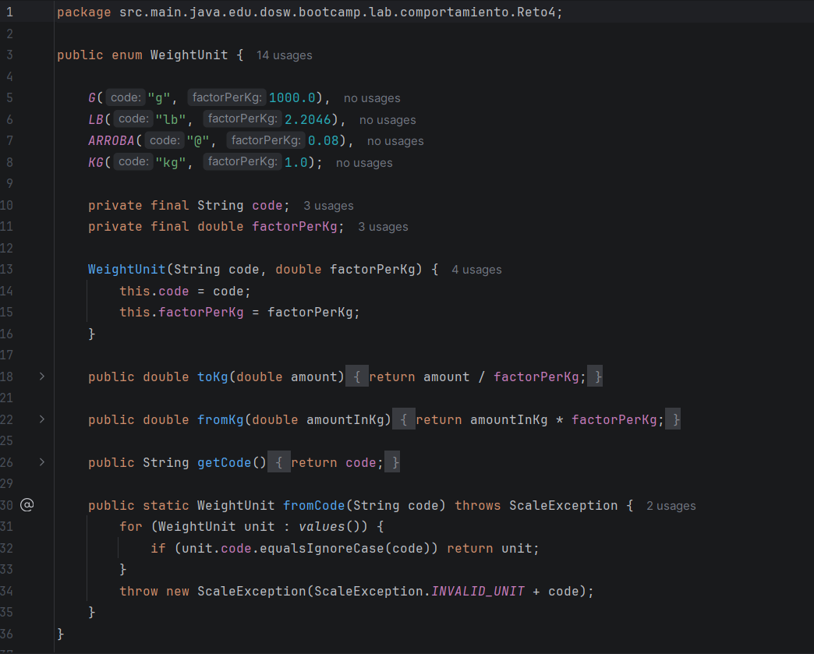

---

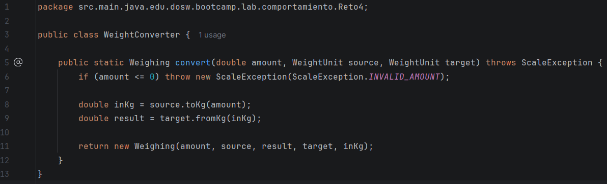

---

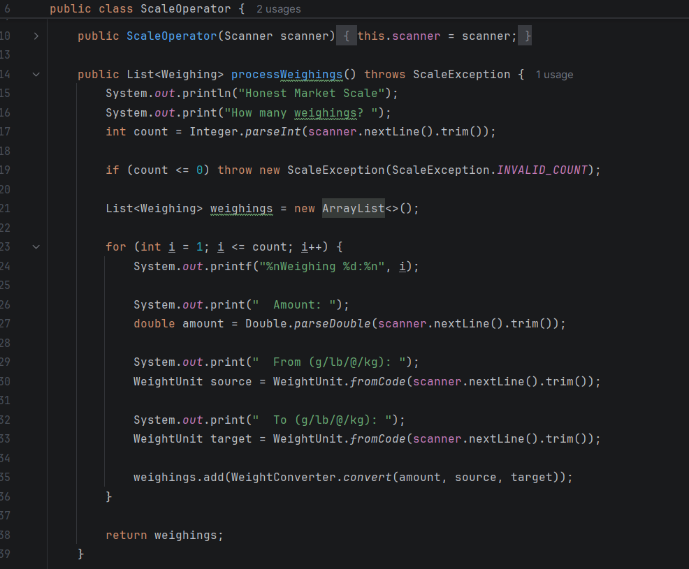

---

**Cómo lo apliqué — clases y rol de cada una:**

| Rol | Clase | Responsabilidad |
|---|---|---|
| **Estrategia (Strategy)** | `WeightUnit` | Enum donde cada constante encapsula su factor y los algoritmos de conversión `toKg()` y `fromKg()` |
| **Contexto / Conversor** | `WeightConverter` | Ejecuta la estrategia seleccionada convirtiendo de la unidad origen a kg y luego a la unidad destino |
| **Value Object** | `Weighing` | Objeto inmutable que almacena el resultado detallado de un pesaje (cantidades, unidades y equivalente en kg) |
| **Excepción personalizada** | `ScaleException` | Excepción con mensajes constantes para entradas y unidades inválidas |
| **Director / Operador** | `ScaleOperator` | Gestiona la interacción con el usuario, procesa los pesajes y calcula totales con Streams |
| **Punto de entrada** | `MarketScale` | Contiene el método estático `run()` que maneja las excepciones y es llamado desde `Application.java` |

---

### Estructura de Clases

| Archivo | Descripción |
|---|---|
| `WeightUnit.java` | Enum Strategy — define las unidades soportadas y sus algoritmos de conversión |
| `Weighing.java` | Value object inmutable — representa el resultado de un pesaje |
| `WeightConverter.java` | Conversor — aplica las estrategias de conversión entre unidades |
| `ScaleException.java` | Excepción personalizada con constantes para validaciones |
| `ScaleOperator.java` | Operador — coordina la entrada/salida y resumen con Streams |
| `MarketScale.java` | Punto de entrada — método estático `run()` con captura de excepciones |

---

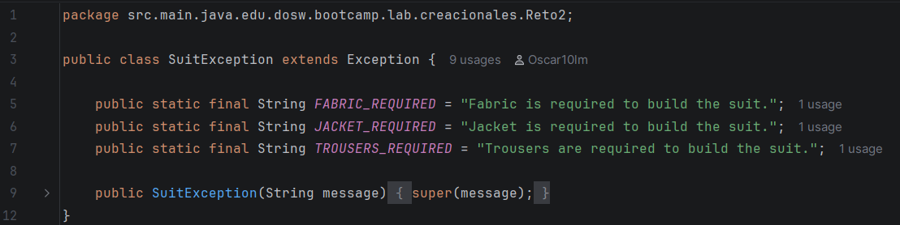

---

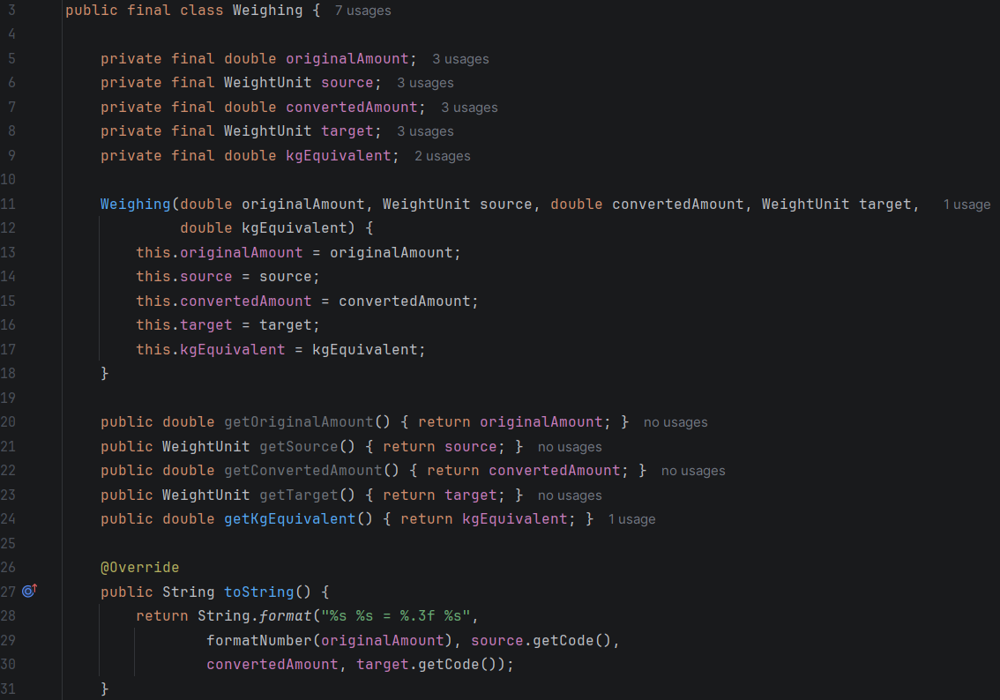

---

### Explicación del Código

1. **`WeightUnit`** — enum que actúa como la estrategia (`Strategy`). Cada constante (`G`, `LB`, `ARROBA`, `KG`) almacena su factor y define los métodos `toKg()` y `fromKg()` para transformar valores hacia y desde la unidad base.

2. **`Weighing`** — clase `final` inmutable que almacena la cantidad original, la unidad de origen, la cantidad convertida, la unidad destino y el equivalente en kilogramos.

3. **`WeightConverter`** — clase encargada de coordinar la conversión. Valida que el monto sea positivo mediante `ScaleException` y ejecuta la conversión delegando a los métodos de `WeightUnit`.

4. **`ScaleException`** — clase de excepción personalizada que define constantes estáticas (`INVALID_UNIT`, `INVALID_AMOUNT`, `INVALID_COUNT`) para evitar cadenas mágicas y estandarizar los mensajes de error.

5. **`ScaleOperator`** — coordina la interacción por consola con el usuario para leer múltiples pesajes. En `displayResults()` utiliza Streams (`mapToDouble(Weighing::getKgEquivalent).sum()`) para calcular el total acumulado en kg.

6. **`MarketScale`** — punto de entrada del reto con el método estático `run()`, encargado de instanciar el operador, coordinar el flujo y manejar `ScaleException` con un bloque `try-catch`.

---
---

# 5 Reto 5

---
---

# 6 Sala de Urgencias (Hospital Emergency)

---

### Patrón de Diseño

**Categoría:** Comportamiento

**Patrón Utilizado:** Chain of Responsibility

**Justificación:**
El problema modela un flujo de atención médica escalonado donde una solicitud (un paciente con síntoma, gravedad y prioridad) debe pasar a través de una cadena secuencial de profesionales de salud (Enfermero → Médico General → Especialista). Cada profesional evalúa si puede atender al paciente según sus capacidades de nivel y prioridad o si debe remitirlo al siguiente eslabón. Si ningún profesional puede resolver el caso, el final de la cadena lo marca automáticamente como remitido a otra institución.
---


---

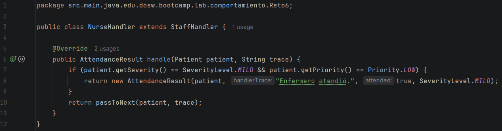

---


---


---

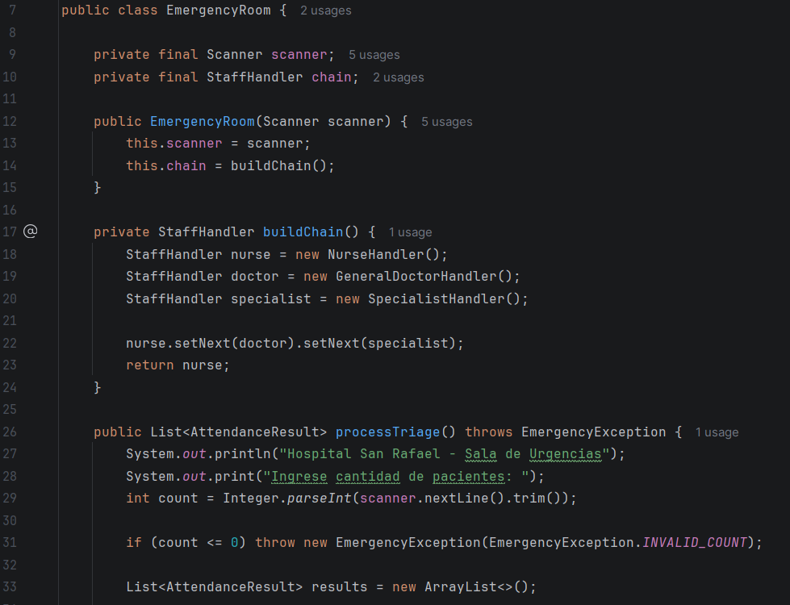

---

**Cómo lo apliqué — clases y rol de cada una:**

| Rol | Clase | Responsabilidad |
|---|---|---|
| **Manejador Base (Handler)** | `StaffHandler` | Clase abstracta que define el enlace al siguiente manejador (`setNext`) y el método de procesamiento (`handle`) |
| **Manejador Concreto (Concrete Handler 1)** | `NurseHandler` | Atiende dolencias de nivel Leve con prioridad Baja; en caso contrario pasa al siguiente |
| **Manejador Concreto (Concrete Handler 2)** | `GeneralDoctorHandler` | Atiende nivel Moderado con prioridad Baja, o deriva con traza al especialista si la prioridad es Media/Alta |
| **Manejador Concreto (Concrete Handler 3)** | `SpecialistHandler` | Atiende dolencias de nivel Grave o casos moderados escalados; si es Crítico remite fuera de la institución |
| **Value Object (Paciente)** | `Patient` | Objeto inmutable que almacena el id, síntoma, nivel de gravedad y prioridad del paciente |
| **Value Object (Resultado)** | `AttendanceResult` | Objeto inmutable con el resultado de la atención, profesional asignado y traza de remisión |
| **Excepción personalizada** | `EmergencyException` | Maneja validaciones de conteo, gravedad o prioridad inválidas con constantes |
| **Coordinador / Director** | `EmergencyRoom` | Ensambla la cadena de atención, recibe a los pacientes y genera estadísticas con Streams |
| **Punto de entrada** | `HospitalEmergency` | Contiene el método estático `run()` con manejo de errores, invocado desde `Application.java` |

---

### Estructura de Clases

| Archivo | Descripción |
|---|---|
| `StaffHandler.java` | Clase abstracta base para la cadena de responsabilidad |
| `NurseHandler.java` | Manejador concreto para atención de enfermería (Leve / Baja) |
| `GeneralDoctorHandler.java` | Manejador concreto para medicina general (Moderado) |
| `SpecialistHandler.java` | Manejador concreto para médico especialista (Grave / Derivados) |
| `Patient.java` | Value object inmutable que representa los datos de un paciente |
| `AttendanceResult.java` | Value object inmutable con el resultado final de la atención |
| `SeverityLevel.java` | Enum con los niveles de gravedad (Leve, Moderado, Grave, Crítico) |
| `Priority.java` | Enum con las prioridades de triaje (Baja, Media, Alta) |
| `EmergencyException.java` | Excepción personalizada con constantes para validaciones |
| `EmergencyRoom.java` | Coordinador de triaje, construcción de la cadena y estadísticas con Streams |
| `HospitalEmergency.java` | Punto de entrada — método estático `run()` con captura de excepciones |

---

### Explicación del Código

1. **`StaffHandler`** — clase abstracta que implementa la estructura del patrón Chain of Responsibility mediante `setNext()` para encadenar los profesionales y `passToNext()` para transferir la solicitud al siguiente si el actual no puede atenderla.

2. **`NurseHandler`, `GeneralDoctorHandler` y `SpecialistHandler`** — manejadores concretos donde cada uno evalúa la severidad y prioridad del `Patient`. El enfermero atiende casos leves, el médico general atiende o remite moderados, y el especialista resuelve casos graves o moderados escalados.

3. **`Patient` y `AttendanceResult`** — clases `final` inmutables. `Patient` almacena los datos de ingreso y `AttendanceResult` encapsula el estado final, la traza de remisión y el profesional que atendió.

4. **`SeverityLevel` y `Priority`** — enums que tipifican los niveles de dolencia y la prioridad de atención, con métodos de parseo que lanzan `EmergencyException` ante entradas no reconocidas.

5. **`EmergencyException`** — clase de excepción personalizada que define constantes estáticas (`INVALID_COUNT`, `INVALID_SEVERITY`, `INVALID_PRIORITY`) para centralizar los mensajes de error.

6. **`EmergencyRoom`** — construye la cadena en `buildChain()` vinculando `NurseHandler` → `GeneralDoctorHandler` → `SpecialistHandler`. En `displayReport()` utiliza Streams (`filter`, `count`, `mapToInt`, `average`) para contabilizar pacientes atendidos por nivel, remitidos y el promedio de prioridad.

7. **`HospitalEmergency`** — punto de entrada que orquesta la ejecución completa en su método estático `run()` dentro de un bloque `try-catch` para capturar `EmergencyException`.

---
 
 
 # PREGUNTAS INICIALES
01. ¿Qué ventaja ofrece el polimorfismo en el diseño de clases frente al uso de múltiples condicionales para determinar el comportamiento de un objeto?
- El polimorfismo permite que cada clase defina su propio comportamiento mediante un método común, evitando condicionales repetitivos y logrando código más flexible, mantenible y abierto a extensión sin modificar lo existente.


02. ¿Por qué una clase inmutable puede mejorar la seguridad en un sistema?

- En una clase inmutable los objetos no pueden modificar su estado después de ser creados. Esto puede mejorar la seguridad porque evita que otros objetos cambien accidentalmente los datos.

03. ¿Qué problema podría aparecer en un sistema si los atributos de las clases se mantienen públicos en lugar de privados con getters y setters controlados?
- Si los atributos son públicos, cualquier clase externa puede modificarlos directamente sin validación, rompiendo el encapsulamiento y dejando el objeto en estados inconsistentes o inválidos.

04. Según el principio Abierto/Cerrado, ¿cómo deberíamos modificar el sistema si queremos añadir una nueva funcionalidad sin alterar el código existente?

- Una clase debe estar abierta para extensión, pero cerrada para modificación. Cuando se necesita agregar una nueva funcionalidad se usa herencia, interfaces o composición sin modificar directamente las clases que ya funcionan.

05. ¿Por qué es importante que una clase cumpla con el Principio de Única Responsabilidad? Da un ejemplo donde se vulnere.
- El SRP importa porque una clase con una sola responsabilidad es más fácil de mantener, probar y modificar sin afectar funcionalidades no relacionadas.

Ejemplo de violación:

```java
public class Empleado {
    public double calcularPago() { ... }
    public void guardarEnBaseDeDatos() { ... }
    public void imprimirReciboPDF() { ... }
}
```

Se rompe porque mezcla tres razones distintas para cambiar en una sola clase, así que modificar una puede afectar sin querer a las otras.

06. ¿Qué es y para qué usamos el pom.xml?

- El pom.xml es el archivo principal de configuración de un proyecto Maven, se utiliza este archivo para saber cómo compilar, probar y empaquetar la aplicación.

07. ¿Qué diferencia hay entre mvn compile, mvn package y mvn install?
- mvn compile: compila el código fuente a .class, sin generar artefacto empaquetado.
- mvn package: compila, corre las pruebas y empaqueta el proyecto en jar o war dentro de target.
- mvn install: hace todo lo de package y además instala ese artefacto en el repositorio local de Maven para que otros proyectos puedan usarlo.

Son fases acumulativas: compile, luego test, luego package, luego install.

08. ¿Qué diferencia existe entre una interfaz y una clase abstracta?

- Una interfaz define unos comportamientos que las clases deben implementar. Una clase puede implementar varias interfaces, lo que permite que diferentes clases compartan un mismo comportamiento, en cambio, una clase abstracta no puede ser instanciada directamente y puede contener tanto métodos abstractos como métodos con implementación. Una clase solo puede heredar de una clase abstracta.
