# HACKATHON EXPRESS 2026-2

# 1 La Boletería del Cine Astor

---

### Principios SOLID Aplicados

**Justificación:**

El Reto 1 requiere manejar diferentes tipos de espectadores, productos de la boletería, una orden de compra y el cálculo de los valores de la factura.

La solución separa estas responsabilidades en diferentes clases. BoleteriaAstor se encarga de la interacción con el usuario, Orden administra los elementos de la compra, Calculadora realiza los cálculos de subtotal, descuento y total, mientras que las clases de espectadores encapsulan el comportamiento asociado al descuento.

La utilización de una clase base Espectador y sus especializaciones permite manejar los diferentes tipos de espectadores mediante polimorfismo, evitando que la lógica de descuentos tenga que estar concentrada en la clase principal.

---

---

### Cómo lo apliqué — clases y rol de cada una

| Rol | Clase | Responsabilidad |
|---|---|---|
| **Punto de entrada** | `BoleteriaAstor` | Maneja la interacción con el usuario, recibe el tipo de espectador y las cantidades de productos, y presenta la factura. |
| **Producto** | `Boleta` | Representa una boleta de cine y almacena su nombre, precio y cantidad. |
| **Producto** | `Confiteria` | Representa un producto de confitería y almacena su información de precio y cantidad. |
| **Agregador** | `Orden` | Mantiene la colección de elementos que forman parte de la compra. |
| **Cálculos** | `Calculadora` | Calcula subtotal, descuento y total de la orden. |
| **Abstracción** | `Espectador` | Define el comportamiento común de los diferentes tipos de espectadores. |
| **Especialización** | `EspectadorGeneral` | Representa al espectador general y su descuento correspondiente. |
| **Especialización** | `Estudiante` | Representa al espectador estudiante y su descuento correspondiente. |
| **Especialización** | `TerceraEdad` | Representa al espectador de tercera edad y su descuento correspondiente. |

### Estructura de Clases

| Archivo | Descripción |
|---|---|
| `BoleteriaAstor.java` | Punto de entrada del reto. Gestiona la entrada del usuario y presenta la factura. |
| `Orden.java` | Administra los elementos que forman parte de la compra. |
| `ItemOrden.java` | Define la estructura común de los elementos que pueden agregarse a una orden. |
| `Boleta.java` | Representa una boleta de cine con su nombre, precio y cantidad. |
| `Confiteria.java` | Representa un producto de confitería con su nombre, precio y cantidad. |
| `Calculadora.java` | Centraliza los cálculos de subtotal, descuento y total. |
| `Espectador.java` | Define la información y comportamiento común de un espectador. |
| `EspectadorGeneral.java` | Implementa el comportamiento del espectador general. |
| `Estudiante.java` | Implementa el comportamiento del espectador estudiante. |
| `TerceraEdad.java` | Implementa el comportamiento del espectador de tercera edad. |

---

### Explicación del Código

1. **`ItemOrden`** — define la estructura común de los elementos que pueden formar parte de una orden, permitiendo que `Boleta` y `Confiteria` puedan ser tratados de manera uniforme.

2. **`Boleta`** — representa los diferentes tipos de boleta disponibles. Cada instancia contiene el nombre, precio y cantidad seleccionada.

3. **`Confiteria`** — representa los productos de confitería disponibles, manteniendo su información de precio y cantidad.

4. **`Orden`** — mantiene la lista de elementos agregados a la compra y proporciona las operaciones necesarias para agregar y consultar dichos elementos.

5. **`Espectador`** — establece el comportamiento común para los diferentes tipos de espectadores. Cada especialización proporciona el descuento correspondiente.

6. **`EspectadorGeneral`, `Estudiante` y `TerceraEdad`** — permiten representar los tres tipos de espectadores mediante herencia y polimorfismo. Cada clase proporciona el descuento correspondiente sin que `Calculadora` tenga que conocer los detalles específicos de cada tipo.

7. **`Calculadora`** — concentra las operaciones matemáticas relacionadas con la factura: subtotal, descuento y total. De esta manera, estos cálculos no quedan mezclados con la interacción del usuario.

8. **`BoleteriaAstor`** — funciona como punto de entrada del reto. Recibe el tipo de espectador, las cantidades de cada producto y finalmente muestra la factura.

### Evidencia de Ejecución

Se realizaron pruebas con los tres tipos de espectadores disponibles:

- **Espectador General:** 0% de descuento.
- **Estudiante:** 15% de descuento.
- **Tercera Edad:** 25% de descuento.

También se verificó que la orden permite seleccionar cantidades de Boleta 2D, Boleta 3D, Crispetas y Gaseosa, y que el subtotal, descuento y total se calculan correctamente.

General sin descuento

Estudiante con el 15% descuento

Tercera edad con el 25% descuento

---

# 2 El Sastre a la Medida (Tailor Shop)

---

### Patrón de Diseño

**Categoría:** Creacional

**Patrón Utilizado:** Builder

**Justificación:**
El problema exige construir un objeto complejo (un traje) pieza por pieza, donde algunas partes son obligatorias (tela, saco, pantalón) y otras son opcionales (chaleco, forro en seda, bordado). El patrón Builder es la elección exacta porque separa el proceso de construcción del producto final, permite incluir selectivamente las piezas opcionales, y garantiza que el objeto solo se crea cuando todas las partes obligatorias están presentes.
---

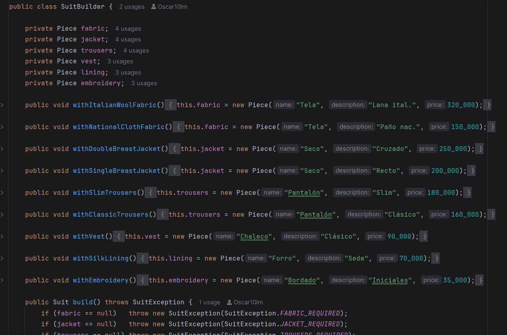

---

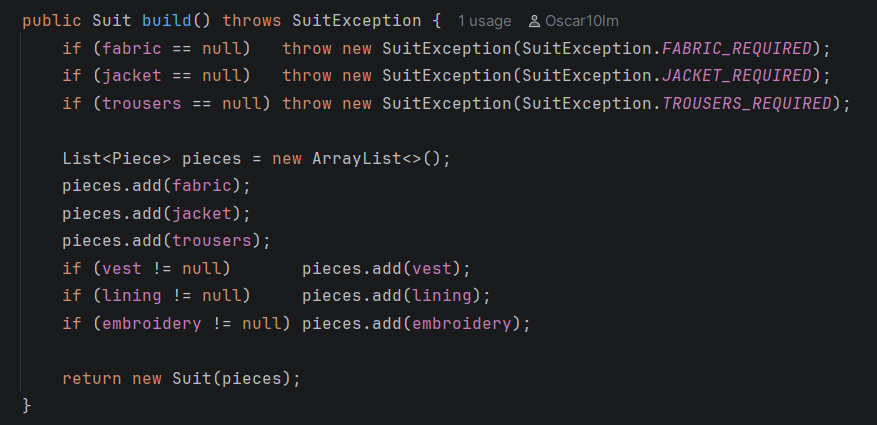

---

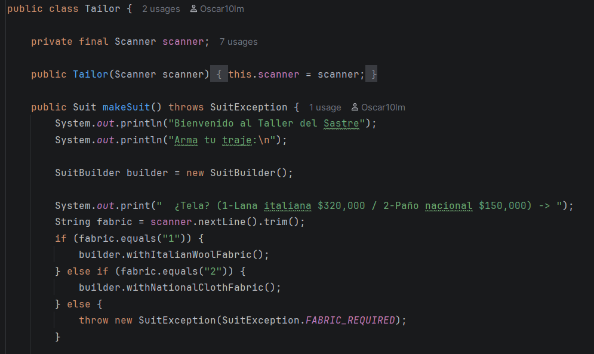

---

**Cómo lo apliqué — clases y rol de cada una:**

| Rol | Clase | Responsabilidad |
|---|---|---|
| **Producto** | `Suit` | Objeto final inmutable que contiene todas las piezas seleccionadas |
| **Builder** | `SuitBuilder` | Ensambla el traje pieza por pieza mediante métodos fluidos y valida las piezas obligatorias en `build()` |
| **Director** | `Tailor` | Dirige la construcción leyendo la entrada del usuario, valida opciones válidas (`1`/`2` y `s`/`n`) y dirige el builder |
| **Value Object** | `Piece` | Representación inmutable de cada componente del traje (nombre, descripción, precio) |
| **Punto de entrada** | `TailorShop` | Contiene el método estático `run(Scanner)` y `run()` con manejo de excepciones |

---

### Estructura de Clases

| Archivo | Descripción |
|---|---|
| `Piece.java` | Value object inmutable — nombre, descripción y precio de cada pieza formateado con concatenación `+` |
| `Suit.java` | Producto final — precio total calculado con Streams y visualización en consola |
| `SuitBuilder.java` | Builder — métodos fluidos para ensamblar y validación de piezas obligatorias con excepción personalizada |
| `SuitException.java` | Excepción personalizada con constantes para cada validación (`FABRIC_REQUIRED`, `JACKET_REQUIRED`, `TROUSERS_REQUIRED`, `INVALID_OPTION`) |
| `Tailor.java` | Director — lee y valida estrictamente las opciones del usuario (`1`/`2` para obligatorias, `s`/`n` para opcionales: chaleco, forro y bordado) |
| `TailorShop.java` | Punto de entrada — método estático `run()` / `run(Scanner)` con manejo de excepciones |

---

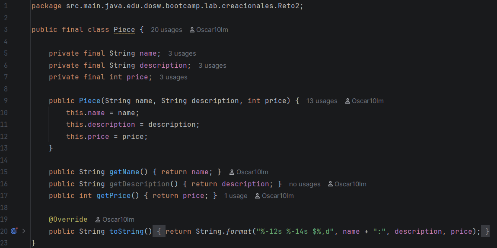

---

---

### Explicación del Código

1. **`Piece`** — clase `final` con tres campos `private final`. Una vez creado el objeto no puede ser modificado, cumpliendo con el requisito de inmutabilidad.

2. **`SuitBuilder`** — declara un campo `Piece` por cada componente del traje. Cada método `with...()` asigna el campo correspondiente. `build()` exige las tres piezas obligatorias lanzando `SuitException` con constantes descriptivas si falta alguna, luego ensambla y retorna el `Suit`.

3. **`SuitException`** — excepción personalizada que extiende `Exception`. Define constantes `FABRIC_REQUIRED`, `JACKET_REQUIRED`, `TROUSERS_REQUIRED` e `INVALID_OPTION` en español para centralizar los mensajes de error.

4. **`Suit`** — almacena la lista de piezas como lista no modificable. `getTotalPrice()` usa Streams para calcular el total sin ningún ciclo. `display()` imprime cada pieza y el total en columnas formateadas mediante concatenación pura (`+`).

5. **`Tailor`** — el Director. `makeSuit()` crea un `SuitBuilder`, solicita al usuario cada pieza (validando que se seleccione `1`/`2` para las obligatorias y `s`/`n` para las opcionales: chaleco, forro de seda y bordado), lanza `SuitException` si la opción es inválida o vacía, llama a `build()` y retorna el `Suit` terminado.

6. **`TailorShop`** — método estático `run()` / `run(Scanner)` que conecta todo, captura `SuitException` y es llamado desde `Application.main()`.

---
---

# 3 La Fábrica de Instrumentos

---

### Patrón de Diseño

**Categoría:** Creacional

**Patrón Utilizado:** Factory

**Justificación:**

El problema requiere crear diferentes tipos de instrumentos pertenecientes a distintas familias (cuerda, viento y percusión) y cada instrumento puede pertenecer a una gama diferente(estudiante, profesional o vintage).

El patrón Factory permite separar la lógica de creación de los instrumentos de la clase que recibe la información del usuario. De esta manera, `FabricaInstrumentos` no necesita conocer los detalles de cómo se construye cada instrumento, sino que delega su creación a `Fabrica`.

La clase `Fabrica` determina la familia solicitada y delega la creación a la clase correspondiente (`Cuerda`, `Viento` o `Percusion`).

---

---

### Cómo lo apliqué — clases y rol de cada una

| Rol | Clase | Responsabilidad |
|---|---|---|
| **Punto de entrada** | `FabricaInstrumentos` | Recibe los datos del usuario, solicita los instrumentos y muestra los resultados y el total. |
| **Factory** | `Fabrica` | Determina la familia del instrumento y delega su creación. |
| **Creador de instrumentos de cuerda** | `Cuerda` | Crea instrumentos pertenecientes a la familia de cuerda y determina su precio base. |
| **Creador de instrumentos de viento** | `Viento` | Crea instrumentos pertenecientes a la familia de viento y determina su precio base. |
| **Creador de instrumentos de percusión** | `Percusion` | Crea instrumentos pertenecientes a la familia de percusión y determina su precio base. |
| **Producto** | `Instrumento` | Representa el instrumento creado y contiene su familia, modelo, gama, afinación y precio. |
| **Enumeración** | `Gama` | Representa las gamas disponibles: Estudiante, Profesional y Vintage. |

---

### Estructura de Clases

| Archivo | Descripción |
|---|---|
| `FabricaInstrumentos.java` | Punto de entrada del reto. Gestiona la entrada del usuario, almacena los instrumentos y muestra los resultados. |
| `Fabrica.java` | Factory encargada de determinar qué clase debe crear el instrumento según su familia. |
| `Cuerda.java` | Gestiona la creación de instrumentos de cuerda y sus precios base. |
| `Viento.java` | Gestiona la creación de instrumentos de viento y sus precios base. |
| `Percusion.java` | Gestiona la creación de instrumentos de percusión y sus precios base. |
| `Instrumento.java` | Producto que representa un instrumento musical con sus características y precio. |
| `Gama.java` | Enum que representa las tres gamas disponibles. |

---

### Explicación del Código

1. **`Gama`** — representa las tres opciones de gama disponibles para los instrumentos: `ESTUDIANTE`, `PROFESIONAL` y `VINTAGE`.

2. **`Instrumento`** — representa el producto final. Contiene información como el nombre del instrumento, familia, gama, afinación y precio.

3. **`Cuerda`** — se encarga de crear los instrumentos pertenecientes a la familia y establece el precio base correspondiente.

4. **`Viento`** — se encarga de crear los instrumentos pertenecientes a la familia y establece el precio base correspondiente.

5. **`Percusion`** — se encarga de crear los instrumentos pertenecientes a la familia y establece el precio base correspondiente.

6. **`Fabrica`** — funciona como Factory. Recibe la familia, modelo y gama, y delega la creación a `Cuerda`, `Viento` o `Percusion`.
   
7. **`FabricaInstrumentos`** — funciona como punto de entrada. Solicita al usuario la cantidad de instrumentos y los datos de cada uno, utiliza la fábrica para crearlos, almacena los resultados y finalmente calcula el total utilizando Streams.

8. **Streams** — el precio total se obtiene mediante un Stream sobre la colección de instrumentos

### Evidencia de Ejecución

Se realizaron pruebas con los tres tipos de familias, modelos y gamas :

Cuerda
Guitarra Violín Bajo
Percusión
Batería Cajón Timbal
Viento
Saxofón Flauta Trompeta

Estudiante-Profesional-Vintage

Toca tener presentes las tildes 

# 4 La Balanza Honesta del Mercado (Market Scale)

---

### Patrón de Diseño

**Categoría:** Comportamiento

**Patrón Utilizado:** Strategy

**Justificación:**
El problema requiere convertir valores de peso entre múltiples unidades dinámicamente según lo que el usuario elija en tiempo de ejecución. Cada unidad de peso encapsula su propia lógica y factor de conversión respecto a una base común (kg), permitiendo intercambiar el algoritmo de conversión de origen y destino sin acoplar el código ni usar condicionales anidados.
---

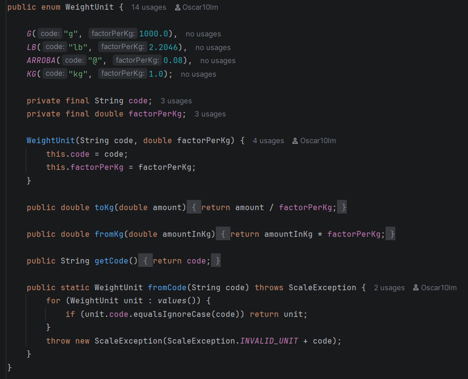

---

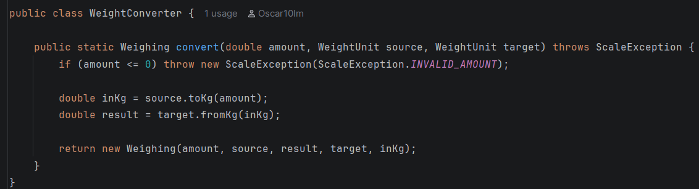

---

**Cómo lo apliqué — clases y rol de cada una:**

| Rol | Clase | Responsabilidad |
|---|---|---|
| **Estrategia (Strategy)** | `WeightUnit` | Enum donde cada constante encapsula su factor y los algoritmos de conversión `toKg()` y `fromKg()` |
| **Contexto / Conversor** | `WeightConverter` | Ejecuta la estrategia seleccionada convirtiendo de la unidad origen a kg y luego a la unidad destino |
| **Value Object** | `Weighing` | Objeto inmutable que almacena el resultado detallado de un pesaje (cantidades, unidades y equivalente en kg) |
| **Excepción personalizada** | `ScaleException` | Excepción con mensajes constantes en español para entradas, conteos y unidades inválidas |
| **Director / Operador** | `ScaleOperator` | Gestiona la interacción con el usuario, valida cantidades numéricas positivas y calcula totales con Streams |
| **Punto de entrada** | `MarketScale` | Contiene el método estático `run()` / `run(Scanner)` que maneja las excepciones y es llamado desde `Application.java` |

---

### Estructura de Clases

| Archivo | Descripción |
|---|---|
| `WeightUnit.java` | Enum Strategy — define las unidades soportadas (`g`, `lb`, `@`, `kg`) y sus algoritmos de conversión |
| `Weighing.java` | Value object inmutable — representa el resultado de un pesaje formateado con concatenación `+` |
| `WeightConverter.java` | Conversor — aplica las estrategias de conversión entre unidades |
| `ScaleException.java` | Excepción personalizada con constantes en español para validaciones (`INVALID_COUNT`, `INVALID_AMOUNT`, `INVALID_UNIT`) |
| `ScaleOperator.java` | Operador — coordina la entrada/salida y resumen con Streams |
| `MarketScale.java` | Punto de entrada — método estático `run()` / `run(Scanner)` con captura de excepciones |

---

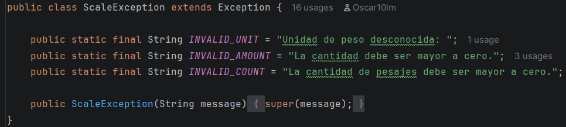

---

---

### Explicación del Código

1. **`WeightUnit`** — enum que actúa como la estrategia (`Strategy`). Cada constante (`G`, `LB`, `ARROBA`, `KG`) almacena su factor y define los métodos `toKg()` y `fromKg()` para transformar valores hacia y desde la unidad base.

2. **`Weighing`** — clase `final` inmutable que almacena la cantidad original, la unidad de origen, la cantidad convertida, la unidad destino y el equivalente en kilogramos.

3. **`WeightConverter`** — clase encargada de coordinar la conversión. Valida que el monto sea positivo mediante `ScaleException` y ejecuta la conversión delegando a los métodos de `WeightUnit`.

4. **`ScaleException`** — clase de excepción personalizada que define constantes estáticas (`INVALID_UNIT`, `INVALID_AMOUNT`, `INVALID_COUNT`) en español para estandarizar los mensajes de error.

5. **`ScaleOperator`** — coordina la interacción por consola con el usuario para leer múltiples pesajes. Valida que la cantidad ingresada sea un número válido y mayor a cero. En `displayResults()` utiliza Streams (`mapToDouble(Weighing::getKgEquivalent).sum()`) para calcular el total acumulado en kg.

6. **`MarketScale`** — punto de entrada del reto con el método estático `run()` / `run(Scanner)`, encargado de instanciar el operador, coordinar el flujo y manejar `ScaleException` con un bloque `try-catch`.

---
# 5 La Moto Personalizada

---

### Patrón de Diseño

**Categoría:** Estructural

**Patrón Utilizado:** Decorator 

**Justificación:**

El Reto 5 requiere permitir que una moto pueda ser personalizada agregando diferentes tipos de mejoras, como accesorios, pinturas y complementos. Cada mejora tiene un precio adicional y debe modificar la descripción final de la moto.

La solución utiliza este patrón ya que permite agregar responsabilidades y características a una moto de manera dinámica sin modificar la clase base `Moto`.

La moto comienza con una configuración básica y cada mejora seleccionada se agrega como un decorador sobre la configuración anterior. De esta manera, es posible combinar diferentes accesorios, pinturas y complementos sin tener que crear una clase para cada combinación posible.

---

### Cómo lo apliqué — clases y rol de cada una

| Rol                     | Clase               | Responsabilidad                                                                   |
| --- | --- | --- |
| **Componente**          | `Mejora`            | Define el comportamiento común de la moto y de las mejoras que pueden agregarse.  |
| **Componente concreto** | `Moto`              | Representa la moto base sobre la cual se realizan las personalizaciones.          |
| **Decorador**           | `MotoPersonalizada` | Permite envolver una moto o mejora existente para agregar nuevas características. |
| **Decorador concreto**  | `Accesorio`         | Representa los accesorios que pueden agregarse a la moto.                         |
| **Decorador concreto**  | `Pintura`           | Representa las diferentes opciones de pintura disponibles.                        |
| **Decorador concreto**  | `Complemento`       | Representa los complementos adicionales que pueden instalarse en la moto.         |

---

### Estructura de Clases

| Archivo  | Descripción   |
| --- | --- |
| `Mejora.java`            | Define el comportamiento común que deben implementar la moto y las diferentes mejoras. |
| `Moto.java`              | Representa la moto base con su nombre y precio inicial.                                |
| `MotoPersonalizada.java` | Implementa el decorador que permite agregar personalizaciones de forma dinámica.       |
| `Accesorio.java`         | Representa las mejoras correspondientes a accesorios.                                  |
| `Pintura.java`           | Representa las mejoras correspondientes a pinturas.                                    |
| `Complemento.java`       | Representa las mejoras correspondientes a complementos.                                |

---

### Explicación del Código

1. **`Mejora`** — define la estructura común para la moto y las diferentes mejoras que pueden agregarse

2. **`Moto`** — representa la moto base del taller. En este ejercicio se utiliza una **Naked 250** con un precio inicial de **$9.800.000**.

3. **`MotoPersonalizada`** — funciona como decorador y permite envolver una moto existente para agregarle nuevas características sin modificar directamente la clase `Moto`.

4. **`Accesorio`** — representa los accesorios disponibles para personalizar la moto:

   * Escape deportivo: **+$1.400.000**
   * Manillar deportivo: **+$480.000**
   * Luces LED: **+$350.000**
   * Alforjas laterales: **+$600.000**

5. **`Pintura`** — representa las diferentes opciones de pintura:

   * Mate negro: **+$900.000**
   * Metalizado tricapa: **+$1.600.000**
   * Vinilo personalizado: **+$700.000**

6. **`Complemento`** — representa los complementos disponibles:

   * GPS integrado: **+$1.100.000**
   * Baúl trasero: **+$550.000**
   * Sistema de sonido: **+$820.000**

7. **`MotoPersonalizada`**, junto con `Accesorio`, `Pintura` y `Complemento`, permite encadenar diferentes mejoras sobre la moto base. Cada decoración agrega su propio precio y descripción.

8. **`MotoPersonalizada.java`** — contiene la interacción con el usuario. Presenta las diferentes opciones de mejora, recibe las selecciones y construye la moto personalizada.

---

### Evidencia de Ejecución

Se realizaron pruebas seleccionando diferentes combinaciones de mejoras para verificar que el precio y la descripción final de la moto se actualizan correctamente.

**Moto sin mejoras**

**Moto con escape deportivo, pintura mate negro y baúl trasero**

**Moto con manillar deportivo, pintura metalizado tricapa y gps integrado**

---

# 6 Sala de Urgencias (Hospital Emergency)

---

### Patrón de Diseño

**Categoría:** Comportamiento

**Patrón Utilizado:** Chain of Responsibility

**Justificación:**
El problema modela un flujo de atención médica escalonado donde una solicitud (un paciente con síntoma, gravedad y prioridad) debe pasar a través de una cadena secuencial de profesionales de salud (Enfermero → Médico General → Especialista). Cada profesional evalúa si puede atender al paciente según sus capacidades de nivel y prioridad o si debe remitirlo al siguiente eslabón. Si ningún profesional puede resolver el caso (o es nivel Crítico), el final de la cadena lo marca automáticamente como remitido a otra institución.
---
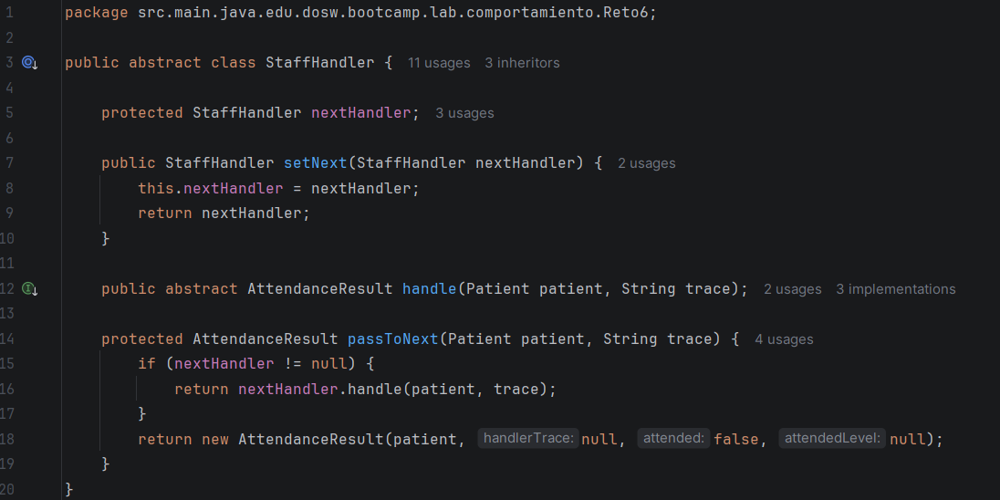

---

---

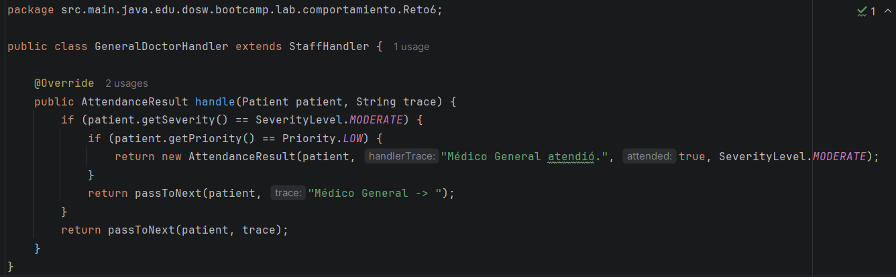

---

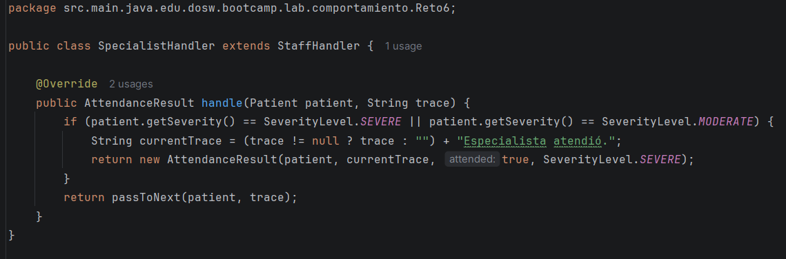

---

---

**Cómo lo apliqué — clases y rol de cada una:**

| Rol | Clase | Responsabilidad |
|---|---|---|
| **Manejador Base (Handler)** | `StaffHandler` | Clase abstracta que define el enlace al siguiente manejador (`setNext`) y el método de procesamiento (`handle`) |
| **Manejador Concreto (Concrete Handler 1)** | `NurseHandler` | Atiende dolencias de nivel Leve con prioridad Baja (1); en caso contrario pasa al siguiente |
| **Manejador Concreto (Concrete Handler 2)** | `GeneralDoctorHandler` | Atiende nivel Moderado con prioridad Media (2) o Leve escalado; en caso contrario pasa al siguiente |
| **Manejador Concreto (Concrete Handler 3)** | `SpecialistHandler` | Atiende dolencias de nivel Grave con prioridad Alta (3) o casos moderados escalados; si es Crítico pasa al final de la cadena |
| **Value Object (Paciente)** | `Patient` | Objeto inmutable que almacena el id, síntoma, nivel de gravedad y prioridad del paciente |
| **Value Object (Resultado)** | `AttendanceResult` | Objeto inmutable con el resultado de la atención, profesional asignado y traza de remisión |
| **Excepción personalizada** | `EmergencyException` | Maneja validaciones de conteo, gravedad o prioridad inválidas con constantes en español |
| **Coordinador / Director** | `EmergencyRoom` | Ensambla la cadena de atención, recibe a los pacientes (mostrando opciones `Leve/Moderado/Grave` y `Baja/Media/Alta`) y genera estadísticas con Streams |
| **Punto de entrada** | `HospitalEmergency` | Contiene el método estático `run()` / `run(Scanner)` con manejo de errores, invocado desde `Application.java` |

---

### Estructura de Clases

| Archivo | Descripción |
|---|---|
| `StaffHandler.java` | Clase abstracta base para la cadena de responsabilidad |
| `NurseHandler.java` | Manejador concreto para atención de enfermería (Leve / Prioridad Baja $\le 1$) |
| `GeneralDoctorHandler.java` | Manejador concreto para medicina general (Moderado / Prioridad Media $\le 2$) |
| `SpecialistHandler.java` | Manejador concreto para médico especialista (Grave / Prioridad Alta $\le 3$) |
| `Patient.java` | Value object inmutable que representa los datos de un paciente |
| `AttendanceResult.java` | Value object inmutable con el resultado final de la atención formateado con `+` |
| `SeverityLevel.java` | Enum con los niveles de gravedad (Leve, Moderado, Grave, Crítico) |
| `Priority.java` | Enum con las prioridades de triaje (Baja, Media, Alta) |
| `EmergencyException.java` | Excepción personalizada con constantes en español para validaciones |
| `EmergencyRoom.java` | Coordinador de triaje, construcción de la cadena y estadísticas con Streams |
| `HospitalEmergency.java` | Punto de entrada — método estático `run()` / `run(Scanner)` con captura de excepciones |

---

### Explicación del Código

1. **`StaffHandler`** — clase abstracta que implementa la estructura del patrón Chain of Responsibility mediante `setNext()` para encadenar los profesionales y `passToNext()` para transferir la solicitud al siguiente si el actual no puede atenderla.

2. **`NurseHandler`, `GeneralDoctorHandler` y `SpecialistHandler`** — manejadores concretos donde cada uno evalúa la severidad y prioridad del `Patient`. El enfermero atiende casos leves con prioridad baja (1), el médico general atiende moderados con prioridad media (2), y el especialista resuelve casos graves con prioridad alta (3). Los casos críticos o que superan la cadena resultan en remisión a otra institución.

3. **`Patient` y `AttendanceResult`** — clases `final` inmutables. `Patient` almacena los datos de ingreso y `AttendanceResult` encapsula el estado final, la traza de remisión y el profesional que atendió sin usar formateadores complejos, solo concatenación `+`.

4. **`SeverityLevel` y `Priority`** — enums que tipifican los niveles de dolencia y la prioridad de atención, con métodos de parseo que lanzan `EmergencyException` ante entradas no reconocidas.

5. **`EmergencyException`** — clase de excepción personalizada que define constantes estáticas (`INVALID_COUNT`, `INVALID_SEVERITY`, `INVALID_PRIORITY`) en español para centralizar los mensajes de error.

6. **`EmergencyRoom`** — construye la cadena en `buildChain()` vinculando `NurseHandler` → `GeneralDoctorHandler` → `SpecialistHandler`. En `displayReport()` utiliza Streams (`filter`, `count`, `mapToInt`, `average`) para contabilizar pacientes atendidos por nivel, remitidos y el promedio de prioridad.

7. **`HospitalEmergency`** — punto de entrada que orquesta la ejecución completa en su método estático `run()` dentro de un bloque `try-catch` para capturar `EmergencyException`.

---
# 7 El Rover Explorador de Marte

---

### Patrón de Diseño

**Categoría:** Comportamiento

**Patrón Utilizado:** Command 

**Justificación:**

El Reto 7 requiere controlar diferentes acciones realizadas por el rover sobre sus módulos, como avanzar o retroceder con el motor, recoger o soltar objetos con el brazo, grabar o detener la cámara y perforar o retraer el taladro y cada acción puede recibir parámetros, debe registrar qué operador la ejecutó, mantenerse en un historial y permitir que una acción individual pueda deshacerse.

El patrón **Command** es adecuado para este problema porque permite encapsular cada acción como un objeto independiente, lo que nos permite hacer el historial

---

### Cómo lo apliqué — clases y rol de cada una

| Rol                  | Clase             | Responsabilidad                                                                                                             |
| -------------------- | ----------------- | --------------------------------------------------------------------------------------------------------------------------- |
| **Comando**          | `Comando`         | Define las operaciones que deben implementar los comandos, principalmente ejecutar y deshacer una acción.                   |
| **Comando concreto** | `Accion`          | Representa una acción realizada sobre un módulo del rover y almacena la información necesaria para ejecutarla y deshacerla. |
| **Receptor**         | `Motor`           | Ejecuta las acciones de avanzar y retroceder una determinada cantidad de metros.                                            |
| **Receptor**         | `Brazo`           | Ejecuta las acciones de recoger y soltar objetos.                                                                           |
| **Receptor**         | `Camara`          | Ejecuta las acciones de grabar y detener la grabación durante un número determinado de segundos.                            |
| **Receptor**         | `Taladro`         | Ejecuta las acciones de perforar y retraer el taladro según una profundidad determinada.                                    |
| **Historial**        | `Historial`       | Mantiene el registro completo de las acciones ejecutadas y permite consultar las acciones realizadas.                       |
| **Invocador**        | `RoverExplorador` | Coordina la ejecución de las acciones, recibe las decisiones del operador y permite ejecutar o deshacer comandos.           |

---

### Estructura de Clases

| Archivo                | Descripción                                                                                                                 |
| ---------------------- | --------------------------------------------------------------------------------------------------------------------------- |
| `Comando.java`         | Define la interfaz común para los comandos del rover, incluyendo las operaciones de ejecución y deshacer.                   |
| `Accion.java`          | Representa un comando concreto y contiene la información de la acción, módulo, parámetros y operador.                       |
| `Motor.java`           | Representa el módulo encargado de avanzar y retroceder el rover.                                                            |
| `Brazo.java`           | Representa el módulo encargado de recoger y soltar objetos.                                                                 |
| `Camara.java`          | Representa el módulo encargado de grabar y detener la grabación.                                                            |
| `Taladro.java`         | Representa el módulo encargado de perforar y retraer el taladro.                                                            |
| `Historial.java`       | Almacena todas las acciones realizadas y su estado, incluyendo las acciones deshechas.                                      |
| `RoverExplorador.java` | Punto de entrada del reto. Gestiona la interacción con el usuario, los operadores, la ejecución de acciones y el historial. |

---

### Explicación del Código

1. **`Comando`** — define el contrato que deben cumplir las acciones del rover. Al establecer operaciones como `ejecutar()` y `deshacer()`, permite que diferentes acciones puedan manejarse de manera uniforme.

2. **`Accion`** — representa una acción que será ejecutada sobre alguno de los módulos del rover. La acción contiene la información necesaria para identificar el módulo, la operación realizada, sus parámetros y el operador que la envió.

3. **`Motor`** — representa el módulo encargado del movimiento del rover. Permite realizar acciones como avanzar y retroceder indicando la cantidad de metros.

4. **`Brazo`** — representa el módulo encargado de manipular objetos. Sus operaciones principales son recoger y soltar.

5. **`Camara`** — representa el módulo encargado de realizar grabaciones. Permite iniciar y detener la grabación y recibe como parámetro la duración en segundos.

6. **`Taladro`** — representa el módulo encargado de realizar perforaciones. Permite perforar una determinada profundidad y posteriormente retraer el taladro para deshacer la acción.

7. **`Historial`** — mantiene el registro de todas las acciones realizadas por los operadores. Esto permite conservar información sobre el orden de ejecución, el módulo utilizado, la acción, los parámetros y el operador responsable.

8. **`RoverExplorador`** — funciona como punto de entrada del programa y coordina la interacción con el usuario. Permite seleccionar las acciones, asignarlas a un operador, ejecutarlas y posteriormente deshacer una acción específica del historial.

---

### Evidencia de Ejecución

Se realizaron pruebas con diferentes acciones y operadores para verificar el funcionamiento del patrón Command.

**Ejecución de acciones del operador Camila**

**Ejecución de acciones del operador Julián**

**Deshacer una acción y mostrar el historial**

---

# 8 La Academia de Fútbol de los UML (Football Academy)

---

### Patrón de Diseño y Modelado UML

**Categorías:** Creacional / Estructural / Comportamiento

**Patrón Utilizado:** Builder (para atributos dinámicos) y Herencia / Polimorfismo con Encapsulamiento Completo.

**Justificación:**
El problema modela una academia de fútbol con jugadores de diversas posiciones (`Delantero`, `Defensa`, `Portero`), entrenadores que dirigen y evalúan, e hinchas que interactúan con ellos. Para los atributos dinámicos del jugador (país de origen, posición secundaria, valor de mercado, historial de lesiones) se implementa el patrón **Builder**, permitiendo configurar estos datos de manera fluida y desacoplada sin sobrecargar los constructores de las subclases.

---

### Estructura de Clases

| Archivo | Descripción |
|---|---|
| `Person.java` | Clase abstracta base con atributos encapsulados (`name`, `age`) y sus getters/setters |
| `Player.java` | Clase abstracta base que hereda de `Person`. Encapsula atributos base, atributos dinámicos, métodos abstractos `patear()`, `entrenar()` y getters/setters |
| `Defender.java` | Subclase de `Player` — implementa `entrenar()` (entradas y recuperaciones) y `patear()` (despeje) |
| `Forward.java` | Subclase de `Player` — implementa `entrenar()` (definición y control) y `patear()` (remate) |
| `Goalkeeper.java` | Subclase de `Player` — implementa `entrenar()`, `patear()` y método propio `atajar()` |
| `Coach.java` | Subclase de `Person` — representa al entrenador con `specialty` y `assignedPlayers`. Métodos: `dirigir()`, `evaluar()`, `planearSesion()`, `addPlayer()` |
| `Fan.java` | Subclase de `Person` — representa al hincha con `favoritePlayers` y `jerseys`. Métodos: `animar()`, `pedirAutografo()`, `publicarFoto()` |
| `PlayerBuilder.java` | Interfaz del patrón Builder para asignación fluida de atributos dinámicos |
| `PlayerBuilderBase.java` | Clase abstracta base para los builders de jugadores |
| `DefenderBuilder.java` | Builder concreto para construir instancias de `Defender` |
| `ForwardBuilder.java` | Builder concreto para construir instancias de `Forward` |
| `GoalkeeperBuilder.java` | Builder concreto para construir instancias de `Goalkeeper` |
| `FootballAcademy.java` | Estructura base para el modelado del reto |

---

### Explicación del Código y Relaciones UML

1. **Herencia y Encapsulamiento:**
   - `Person` es la clase base abstracta de la cual heredan `Player`, `Coach` y `Fan`.
   - `Player` es una clase abstracta especializada de la cual heredan `Forward`, `Defender` y `Goalkeeper`.
   - Todos los atributos están declarados como `private` con sus respectivos métodos de acceso (*getters* y *setters*).

2. **Asociaciones:**
   - **Entrenador $\leftrightarrow$ Jugador:** `Coach` mantiene una lista de agregación de `Player` (`assignedPlayers`) y métodos de interacción (`dirigir(jugador)`, `evaluar(jugador)`, `planearSesion(jugador)`).
   - **Hincha $\leftrightarrow$ Jugador / Entrenador:** `Fan` mantiene referencias a sus jugadores favoritos (`favoritePlayers`), interactúa con jugadores (`animar(jugador)`, `publicarFoto(jugador)`) y con entrenadores (`pedirAutografo(entrenador)`).

3. **Patrón Builder:**
   - Permite la creación y personalización de jugadores con atributos opcionales/dinámicos (`withCountryOfOrigin()`, `withSecondaryPosition()`, `withMarketValue()`, `withInjury()`) retornando la instancia construida mediante `build()`.

---
---

# Aplicación Principal (`Application.java`)

El punto de entrada global de la aplicación ([Application.java](src/main/java/edu/dosw/bootcamp/lab/Application.java)) ofrece un menú interactivo en bucle continuo (`while(true)`):
- **Retos (1, 2, 3, 4, 5, 6, 7):** Ejecutan el reto seleccionado pasando el `Scanner` compartido.
- **Valores fuera de rango o inválidos:** Lanzan excepción indicando `"Lo siento, únicos retos disponibles 1/8."`.
- **Opción `0`:** Finaliza la ejecución del programa con éxito.

---

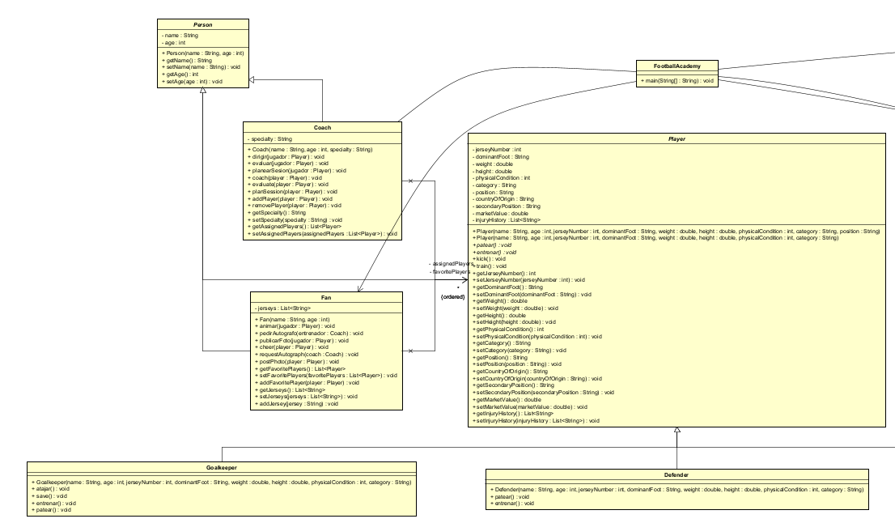
 
----

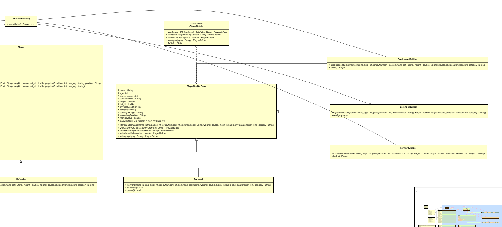

---

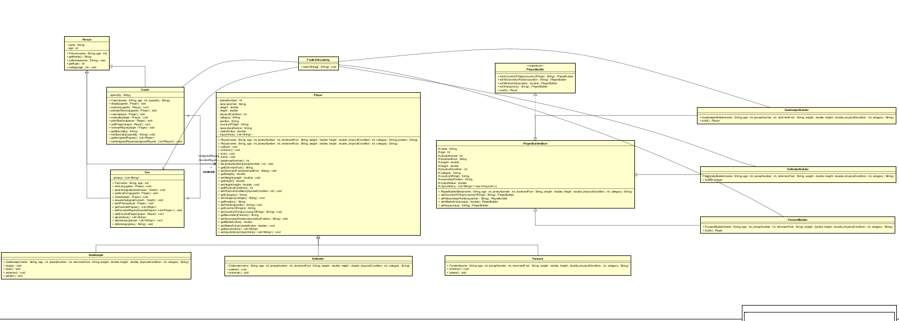
 
 
